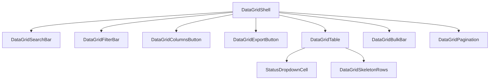

# Design-engineering case study: Data tables that earn their keep

> **What's about to happen, and why.** A future-state proposal for upgrading every list page in the Car Capital UK dealership app from competent-but-inconsistent tables to a coherent system that saves clicks on the day-one tasks dealers actually do.

---

## The dealer's day starts on the master sheet

It's 8:47 on a Tuesday morning at Car Capital UK, a Bedfordshire independent dealer with 114 cars on the lot. Bass Bhai opens the laptop, lands on the dashboard, and clicks through to `/admin/master-sheet` — his digital replacement for the Excel file he ran the business on for nine years.

He's looking for a specific Volkswagen Tiguan that came in last week. He types `GK66 6NX` into the search box at the top of the page. The table filters. He clicks the row to open the detail page. He scrolls. He scrolls back. He needs to update the status from "ready" to "listed". He looks for a dropdown. There isn't one. He clicks "Edit", lands in a full-page form, picks the status, scrolls to the bottom, hits "Save", waits two seconds, gets routed back to the master sheet, and finds his place by re-running the search.

Total: 7 clicks to do something he does 30 times a day.

By the same morning he'll do this with three more vehicles, mark two invoices as sent, export a subset of stock for his accountant, and bulk-update prices on the AutoTrader work list. Today every one of those flows takes more clicks than it should because the table on each page is just a little bit different from the table on every other page.

This case study describes the work we're about to do to fix that.

---

## What we found when we audited

There are nine routes in the app that render a list of things in a table-shaped UI:

| Route | Entity | Rows |
|---|---|---|
| `/admin/master-sheet` | Vehicles (wide grid) | 100s–1000s |
| `/vehicles` | Vehicles (browse) | 100s |
| `/sales/leads` | Leads | 10s–100s |
| `/sales/appointments` | Appointments | 10s–100s |
| `/warranties/claims` | Warranty claims | 10s–100s |
| `/admin/invoicing` | Invoices | 100s |
| `/admin/vendors` | Vendors | 10s |
| `/advert/work-list` | Listings needing prep | 10s–100s |
| `/admin/users-and-permissions` | Team members | <20 |

We checked each against Dmitry Sergushkin's [14 best practices](https://uxplanet.org/best-practices-for-usable-and-efficient-data-table-in-applications-4a1d1fb29550). The picture was patchy:

- **Search** lived on five pages, with three different input styles and no URL sync.
- **Filters** lived on eight pages, in three flavours: select-dropdowns, chip groups, and tab navigation. None could be saved.
- **Sticky headers** lived on five pages, off on four.
- **Bulk selection** lived on exactly one page — and even there, with no toolbar to bulk-act on the selected rows.
- **Customizable column visibility** lived on exactly one page.
- **CSV export** lived on two pages; **PDF export** on one (and only as a single-record action).
- **Pagination** was reimplemented inline on three pages, with no shared state hook.
- **Loading state** was one full-page `<Skeleton>` rather than row-aware placeholders that match column shape.
- **Inline status dropdowns** existed only on a detail page (`/maintenance/jobs/[id]`), never on rows.

We measured before we designed. The numbers say the underlying primitives are already there — `src/components/data-grid/` ships `DataGridShell`, `DataGridTable`, `DataGridRow`, 23 typed cell components, a `ColumnDef<T>` schema, an `exportCsv()` helper — but every page reinvents the table around them in its own way. The gap isn't capability; it's consistency.

---

## The eleven moves we're making

Of the 14 practices in the article, we're shipping eleven. Each one earns its place by reference to a specific workflow Bass Bhai (or one of his sales staff) does every day.

1. **Standardised search**, with URL sync. The current 5 search inputs become one `DataGridSearchBar`, and `?q=GK66` survives a page reload. Bass Bhai keeps his place after refreshing.
2. **Declarative filters** via a `DataGridFilterBar` that takes a `FilterDef<T>[]`. The three current flavours collapse into one — chips that overflow into a popover when they don't fit.
3. **Bulk selection + bulk-action toolbar.** Selection already exists in the type system (`SelectionState`); the toolbar is new. When any row is selected, a strip slides up from the bottom with the count and a row of action buttons declared per page (mark sent, mark paid, archive, export-selected).
4. **Sticky headers, everywhere.** Audit the four pages currently without and turn it on.
5. **CSV and PDF export** from a single `DataGridExportButton`. CSV reuses the existing `exportCsv()`. PDF builds a generic table template on `@react-pdf/renderer` (already in the bundle for invoices, job cards, and warranty certificates).
6. **Customizable column visibility** via `DataGridColumnsButton`. Pull the Master Sheet's Popover-with-checkboxes pattern out as a primitive; let every list page enable it.
7. **Row-aware loading skeletons.** Replace the bare full-height `<Skeleton>` with `DataGridSkeletonRows` that match the actual column structure so there's no layout shift when data lands.
8. **Distinct header / cell styling.** Document the existing convention (small-caps header with icon, larger body cell) so it stops drifting.
9. **Text-left, numbers-right alignment.** `alignFor()` already derives this from `ColType`; we spot-check that every page's column defs use it.
10. **Pagination as a shared component.** Three inline implementations collapse into one `DataGridPagination` + `usePagination()` hook with a "Rows per page" picker.
11. **Inline status dropdowns** via a new `StatusDropdownCell`. Per-entity transition maps (in `src/lib/transitions.ts`) gate which moves are legal. Bass Bhai's 7-click status change becomes 2.

---

## What we're deliberately skipping

This is the section that signals we know when to stop building.

- **Column resize via drag** — high implementation cost, fiddly persistence across users, and the "show/hide columns" button covers 95% of the same need.
- **Inline cell editing** — needs optimistic updates, per-field validation, conflict resolution, undo. Better suited to per-row sheets, which already exist for most entities. We'll revisit when there's a specific row-edit workflow that the sheet form makes worse.
- **Double rows / sub-row content** — our detail pages already show secondary fields. Cluttering the list view with double rows reduces scannability without giving the dealer anything they can't already see in one more click.
- **Infinite scroll** — pagination wins on keyboard and screen-reader access. We're not adopting it.

---

## The shape of the new primitives

The existing `DataGridShell` stays. Eight new sibling primitives compose alongside it:

Every primitive is independent — pages opt in à la carte. Nothing is mandatory. A page that wants search and pagination but no bulk actions imports those two and skips the rest. The existing `ColumnDef<T>` schema (with `key`, `label`, `type`, `sticky`, `width`, `align`, `render`) does not change. Pages that already use it inherit the new features by composition, not by rewriting their render code.

This was a deliberate choice. We considered building a `<DataTable>` mega-component with all features behind a prop wall — and rejected it. Mega-components are great until you need a one-off behaviour and the only escape hatch is forking. Eleven primitives that compose are less elegant on the slide deck and more sustainable in production.

---

## What "shipped" looks like

| Workflow | Before | After |
|---|---|---|
| Find a specific reg on the master sheet | 1 click (search exists) | 1 click (with `?q=` URL preserved) |
| Mark one vehicle as `listed` | 7 clicks (open detail → edit form → scroll → save → return) | 2 clicks (open status dropdown on the row → pick) |
| Bulk-mark 5 invoices as `sent` | 35 clicks (5 × 7) | 3 clicks (select 5 → bulk-action → confirm) |
| Export a filtered subset of stock for the accountant | 5 clicks + manual Excel cleanup | 1 click (export respects active filters) |
| Hide columns you don't care about on the master sheet | Possible (existing custom UI) | Same, but now also available on every other list page |
| See state while loading 100 rows | Full-page grey block | 25 skeleton rows that match the column shape |

The promise is not "the table looks prettier". The promise is "the table fits the way the dealer already works". Search, status change, bulk-mark, export, filter, paginate — these are the verbs of his Tuesday morning. After this work each verb is one or two clicks regardless of which list page he's on.

---

## What we're worried about

Risks we've thought about and the moves to mitigate them:

- **Bulk-action irreversibility.** Bulk-marking 20 invoices is a lot of state to flip in one go. Every bulk action shows a confirm dialog with the affected count, plus a 5-second undo toast.
- **Illegal status transitions.** A sales rep clicking "back to negotiation" on a completed deal would be a real problem. Per-entity transition maps (`src/lib/transitions.ts`) encode the legal graph; the dropdown greys illegal moves.
- **CSV export at scale.** Synchronous JSON-to-CSV blocks the UI past ~5,000 rows. We ship the simple version first; upgrade to chunked streaming if we ever cross that threshold.
- **PDF table rendering** in `@react-pdf/renderer` is fiddly. Pages with >8 visible columns export CSV only on day one; we add multi-page-with-repeated-header PDF after the first PR ships and we've learnt what breaks.
- **"Everything's a dropdown" anti-pattern.** Status, filters, columns, export, bulk — five dropdowns in the same toolbar would tip the page from "powerful" to "fiddly". We're keeping the bulk-bar at the bottom, not in the toolbar, so the top reads as "filter + export" and the bottom as "act on selection".
- **Discoverability.** Eight new primitives risk "engineers don't know they exist". Mitigation: a new "Data grid" section in `docs/reference/design-system.md` with a usage example per primitive, plus this case study linked from there.
- **Surface complexity.** The new public surface is small (8 primitives + one cell type). Every primitive is self-contained — adding the ninth doesn't change the API of the existing ones.

---

## Timeline

Three pull requests, in order:

| PR | Contents | Effort |
|---|---|---|
| 1 | Extend `src/components/data-grid/` with the eight new primitives + `StatusDropdownCell` + `src/lib/transitions.ts`. No page changes. | ~4 days |
| 2 | Apply primitives across the 9 list pages. Order: admin (Master Sheet → Invoicing → Vendors → Users) → sales (Leads → Appointments) → operations (Warranty Claims → Advert Work List) → `/vehicles` last so we lean on lessons learned. | ~8 days |
| 3 | Case study lands (this file), design-system reference picks up the new API, the few cross-cutting docs that mention tables (data-model, services) get a one-line cross-link. | ~1 day |

Total: roughly **thirteen working days**. The first PR is reviewable in isolation — none of its changes are user-visible — so it can land while the rest is in flight.

---

## Next step

Open the first PR. The branch is `claude/data-grid-primitives`. It introduces no breaking changes to existing pages; every consumer keeps its current behaviour until Phase B opts it into the new features.

If you're reading this in the portfolio: the master sheet, vehicles browse, and one more page will already be on the new primitives by the time you click through. The rest is rolling out behind the scenes.

— *Design-engineering team, May 2026*
