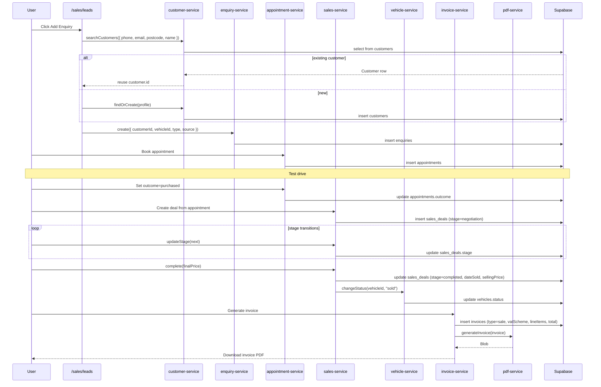

# Flow: Selling a vehicle

> **Audience:** users + developers + AI agents
> **Modules touched:** Sales, Inventory, Administrative (Invoicing)
> **Permissions:** `lead:create`, `appointment:create`, `deal:create`, `deal:stage:change`, `deal:complete`, `invoice:generate`

## Trigger

A prospective buyer contacts the dealer (phone, WhatsApp, website enquiry, walk-in, AutoTrader portal). The sales team logs them and starts the journey toward a sale.

## Outcome

A `SalesDeal` row in stage `completed`, a `Vehicle` with `status=sold` + `dateSold`, and an `Invoice` row (with optional PDF generated and downloaded) describing the sale's VAT scheme and line items.

## Steps

1. **Open the Sales > Leads page** — `/sales/leads`.
2. **Click Add Enquiry** — opens the customer-first dialog. The dialog asks for phone / email / postcode / name and searches `customers` for a match.
3. **Pick existing or create new customer** — `customerService.findOrCreate` either reuses an existing `Customer.id` or inserts a new row.
4. **Fill enquiry details** — vehicle of interest (browse stock), enquiry type (Quick / Full / Sold-to-another), source (where the lead came from), assigned salesperson.
5. **Save** — `enquiryService.create` writes the row. An activity-log entry is appended.
6. **Book an appointment** — from the lead row, "Book appointment" → pick vehicle, slot, salesperson. `appointmentService.create` inserts.
7. **Test drive happens** — at the appointment time. After, the salesperson sets the outcome (interested / not interested / another vehicle / purchased / pending).
8. **Create a deal from the appointment** — opens `/sales/pipeline`. `salesService.create({ vehicleId, customerId, stage: "negotiation" })`.
9. **Stage transitions** — sales staff move the deal through `negotiation → offer → deposit_paid → completion`. Each transition is `salesService.updateStage` and writes to the activity log.
10. **Complete the deal** — final price entered. `salesService.complete` updates the deal to `stage=completed`, sets `dateSold` and `sellingPrice`, and calls `vehicleService.changeStatus(vehicleId, "sold")`.
11. **Generate the invoice** — open `/sales/invoice-generation`, pick the completed deal, choose VAT scheme (`vat_qualifying` or `margin`), review/edit line items, click Generate. `invoiceService.create` writes the invoice; `pdf-service.generateInvoice` produces the PDF blob; `downloadBlob` triggers a browser download.
12. **(Optional) Mark invoice sent** — when the dealer has emailed/printed the PDF to the customer, mark the invoice `sent`. Then `paid` once payment arrives.

## Sequence diagram

## Files in the chain

| Step | File | Role |
|---|---|---|
| Leads page | `src/app/(dashboard)/sales/leads/page.tsx` | Lead list |
| Add Enquiry dialog | `src/components/enquiries/add-enquiry-dialog.tsx` | Top-level dialog |
| Customer search step | `src/components/enquiries/customer-search-step.tsx` | Dedup search |
| Customer service | `src/lib/services/customer-service.ts` | Search / findOrCreate |
| Enquiry service | `src/lib/services/enquiry-service.ts` | Insert / update |
| Appointment service | `src/lib/services/appointment-service.ts` | Booking |
| Pipeline page | `src/app/(dashboard)/sales/pipeline/page.tsx` | Stage view |
| Sales service | `src/lib/services/sales-service.ts` | Create / stage / complete |
| Vehicle service | `src/lib/services/vehicle-service.ts` | Mark sold |
| Invoice page | `src/app/(dashboard)/sales/invoice-generation/page.tsx` | Generate invoice |
| Invoice service | `src/lib/services/invoice-service.ts` | Insert / update / send |
| VAT helpers | `src/lib/vat.ts` | Margin / qualifying arithmetic |
| Invoice template | `src/components/pdf/invoice-template.tsx` | PDF layout |
| PDF service | `src/lib/services/pdf-service.ts` | Render + download |
| Activity service | `src/lib/services/activity-service.ts` | Audit |

## Permissions required

| Step | Capability |
|---|---|
| Create lead / enquiry | `lead:create` |
| Book appointment | `appointment:create` |
| Create deal | `deal:create` |
| Move stage | `deal:stage:change` |
| Complete deal | `deal:complete` |
| Generate invoice | `invoice:generate` |
| Mark invoice sent | `invoice:send` |
| Void invoice | `invoice:void` |

## What can go wrong

| Problem | What happens | Fix |
|---|---|---|
| Customer dedup miss | Two `Customer` rows for the same person (different phone format) | Merge customers — currently manual via DB |
| Appointment outcome left "pending" | Deal never gets created | Sales staff must close out |
| Stage moved backwards | `salesService.updateStage` allows any → any transition | No state-machine guard; activity log shows the regression |
| Deal completed but vehicle status unchanged | The vehicle status update is a separate write; if it fails the deal is `completed` but vehicle isn't `sold` | Manual fix via vehicle detail page |
| Invoice generated before deal completed | The form requires `stage=completed`; UI guard | — |
| VAT scheme picked wrong | Recompute by changing scheme + regenerating; the original invoice can be voided | `invoice:void` capability needed |
| PDF download blocked by browser | Some browsers block multi-download in quick succession | Retry; or open PDF in a new tab via `openBlobInNewTab` |
| Customer lost mid-flow | If the deal is marked `lost`, `LostReason` enum captures why; dashboards aggregate by reason | Standard reporting |
