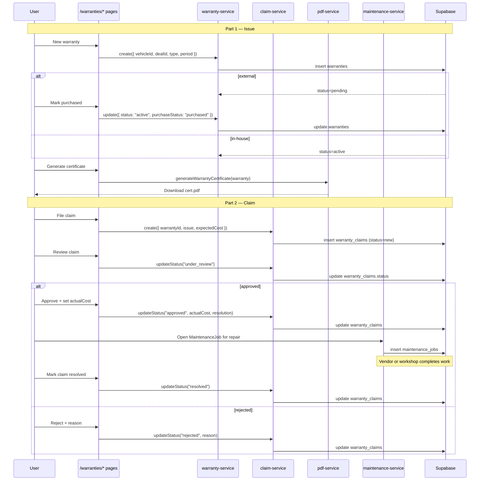

# Flow: Warranty lifecycle

> **Audience:** users + developers + AI agents
> **Modules touched:** Warranties, Sales (deal completion triggers warranty creation), Maintenance (repair work for an approved claim)
> **Permissions:** `warranty:create`, `warranty:update`, `warranty:claim:create`, `warranty:claim:resolve`

## Trigger

A vehicle has been sold (`SalesDeal.stage = completed`, `Vehicle.status = sold`). The dealer either includes a built-in **in-house warranty** as part of the sale or sells an **external warranty** add-on. Months later, the customer reports a problem and the dealer needs to handle a claim.

## Outcome

A `Warranty` row covering a specific vehicle for a specific period, and zero or more `WarrantyClaim` rows describing each issue the customer reported during that period. Each claim ends with a documented resolution (or rejection with reason). The customer may receive a Warranty Certificate PDF on issue.

## Steps

### Part 1 — Issue a warranty

1. **Open the vehicle / deal that's just sold** — `/vehicles/[id]` or `/sales/deals/[id]`.
2. **Open the warranty dialog** — "Add warranty" or via `/warranties/in-house` → "New warranty".
3. **Pick the type** — `in_house` or `external`. In-house warranties go `active` immediately. External warranties go `pending` until the customer pays.
4. **Fill cover details** — start date, end date, coverage notes, exclusions, (for external) provider name + reference number.
5. **Save** — `warrantyService.create` inserts. The warranty is linked to the `SalesDeal` (and through it, the `Vehicle`).
6. **(External only) Mark purchased** — when the customer pays, open the warranty and click "Mark purchased". `warrantyService.update({ purchaseStatus: "purchased", status: "active" })`.
7. **Generate the certificate PDF** — from the warranty detail sheet, click "Certificate". `pdf-service.generateWarrantyCertificate(warranty)` produces the PDF; download or open in new tab.

### Part 2 — Handle a claim

1. **Customer reports an issue** — phone, email, walk-in.
2. **Open the warranty** — `/warranties/[id]`.
3. **Click "File claim"** — opens `new-claim-dialog`. Capture issue description, expected cost, severity.
4. **Save** — `claimService.create` inserts with `status = new`.
5. **Review** — open the claim, optionally add diagnostic notes. Move to `under_review`.
6. **Approve or reject:**
   - **Approve** — set `actualCost` and `resolution`. `claimService.updateStatus("approved")`.
   - **Reject** — record reason. `claimService.updateStatus("rejected")`.
7. **(Approve path) Schedule the repair** — typically opens a Maintenance Job tied to the vehicle. The vendor or in-house workshop completes the work.
8. **Mark resolved** — once repair completes. `claimService.updateStatus("resolved")` with final resolution notes.

## Sequence diagram

## Files in the chain

| Step | File | Role |
|---|---|---|
| Warranty list (in-house) | `src/app/(dashboard)/warranties/in-house/page.tsx` | Filtered table |
| Warranty list (external) | `src/app/(dashboard)/warranties/external/page.tsx` | Filtered table |
| Claims list | `src/app/(dashboard)/warranties/claims/page.tsx` | All claims |
| Warranty detail | `src/app/(dashboard)/warranties/[id]/page.tsx` | Single warranty + claims |
| Warranty dialog | `src/components/warranties/new-warranty-dialog.tsx` | Issue new warranty |
| Mark purchased | `src/components/warranties/mark-purchased-dialog.tsx` | External payment confirmation |
| Claim dialog | `src/components/warranties/new-claim-dialog.tsx` | File a new claim |
| Pending banner | `src/components/warranties/pending-purchase-banner.tsx` | Pending-payment prompt |
| Warranty service | `src/lib/services/warranty-service.ts` | CRUD + `getWithClaims` |
| Claim service | `src/lib/services/claim-service.ts` | CRUD + status transitions |
| Certificate template | `src/components/pdf/warranty-certificate-template.tsx` | PDF layout |
| PDF service | `src/lib/services/pdf-service.ts` | Render + download |
| Activity service | `src/lib/services/activity-service.ts` | Audit every transition |

## Permissions required

| Step | Capability |
|---|---|
| Create warranty | `warranty:create` |
| Update warranty (mark purchased, edit cover) | `warranty:update` |
| File claim | `warranty:claim:create` |
| Approve / reject / resolve claim | `warranty:claim:resolve` |
| Generate certificate PDF | `warranty:create` (issued by anyone who can create) |

## What can go wrong

| Problem | What happens | Fix |
|---|---|---|
| External warranty stays `pending` forever | Customer never paid; no auto-cancel | Sales staff follow up; either mark purchased or delete |
| Claim approved but `actualCost` exceeds expected | Recorded as-is; no cost-overrun alert | Plan: alert on actualCost > expectedCost × 1.5 |
| Claim resolved without a MaintenanceJob | Possible if the repair was external and not logged as a job | Notes field on the claim records what happened |
| Repair done but claim left `approved` | Status doesn't auto-advance to `resolved` | User must mark explicitly |
| Customer reports issue under expired warranty | `Warranty.status = expired` — new claim creation blocked at the dialog level | Customer pays out-of-pocket, no claim filed |
| Wrong vehicle linked to warranty | Edit warranty (`warranty:update`) — change `vehicleId` | Activity log records the change |
| Two warranties for same vehicle (overlap) | Allowed today — both can be active | Plan: warn on overlapping cover periods |
