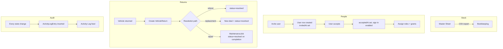

# Administrative

> **Sidebar group:** Administrative
> **Routes owned:** 8
> **Primary entities:** `User`, `Vendor`, `VehicleReturn`, `Invoice`, `ActivityLogEntry`, `Company` (settings)

## What it is  *(stakeholder)*

The Administrative section is the back-office — everything that isn't day-to-day stock or sales operations. The **Master Sheet** is a wide, paginated spreadsheet view of every vehicle (the digital replacement for Bass Bhai's Excel file). The **Master Calendar** unifies appointments, maintenance, and any event across the company. **Users & Permissions** controls who can do what. **Vehicle Returns** handles the rare flow where a sold vehicle comes back. **Invoicing** lists every invoice (purchase + sale). **Vendors** is the directory of external service providers. **Activity Log** is the audit trail. **Settings** holds company-level config.

## What users can do  *(end-user)*

- See every vehicle in the **Master Sheet** with 25-per-page pagination, sort, and CSV export.
- See all events (appointments + maintenance jobs + custom events) in the **Master Calendar** — month view.
- **Invite users**, assign roles, grant or revoke individual capabilities.
- **Deactivate** a user when they leave (preserves history).
- Open a vehicle's **Returns** record if it comes back; pick a resolution path (refund / replacement / repair / finance resolution).
- See all **invoices** — both purchase and sale, draft and sent.
- Mark an invoice **sent**, **paid**, or **void**.
- Manage the **vendor directory** (add, edit, mark inactive).
- Scroll the **Activity Log** to audit any action.
- Edit **Company settings** — name, address, VAT number, logo, stock ID prefix.

Permissions: `user:invite`, `user:role:change`, `user:capability:grant`, `master-sheet:export`, `return:create`, `return:resolve`, `invoice:send`, `invoice:void`, `vendor:create`, `vendor:update`, `settings:update`.

## Routes  *(developer + AI)*

| Route | Page file | Primary component | What it shows |
|---|---|---|---|
| `/admin/master-sheet` | `src/app/(dashboard)/admin/master-sheet/page.tsx` | `MasterSheet` (paginated table) | Every vehicle, 25/page, CSV export |
| `/admin/master-calendar` | `src/app/(dashboard)/admin/master-calendar/page.tsx` | `BigCalendar` month view + event dialogs | Unified events feed |
| `/admin/users-and-permissions` | `src/app/(dashboard)/admin/users-and-permissions/page.tsx` | Users table + invite dialog + capability matrix | Team + roles + grants |
| `/admin/vehicle-returns` | `src/app/(dashboard)/admin/vehicle-returns/page.tsx` | `ReturnsList` + creation dialog | Returns by status |
| `/admin/invoicing` | `src/app/(dashboard)/admin/invoicing/page.tsx` | `InvoiceList` | All invoices, both types |
| `/admin/vendors` | `src/app/(dashboard)/admin/vendors/page.tsx` | `VendorsList` + form | Vendor directory |
| `/admin/activity` | `src/app/(dashboard)/admin/activity/page.tsx` | `ActivityFeed` | Audit timeline |
| `/admin/settings` | `src/app/(dashboard)/admin/settings/page.tsx` | `SettingsForm` | Company config |

## Components  *(developer + AI)*

`src/components/admin/`:

| Component | Purpose |
|---|---|
| Master Sheet table | Wide grid, sticky header, pagination |
| Invite user dialog | Email + role pick |
| User capability matrix | Per-user checkbox grid of all 38 capabilities |
| Return creation dialog | Pick vehicle + reason + path |
| Vendor form | Name + speciality multi-select + contact |
| Settings form | Company fields |

Shared: `src/components/shared/big-calendar.tsx` (Master Calendar), `event-edit-dialog.tsx`, `event-preview-dialog.tsx`, `add-event-sheet.tsx`.

## Services & data  *(developer + AI)*

| Service | Used for |
|---|---|
| `vehicle-service.ts` | Master Sheet rows + return source |
| `team-service.ts` | Invite / deactivate / role change |
| `permission-service.ts` | Capability grant / revoke |
| `return-service.ts` | Return CRUD + resolution |
| `invoice-service.ts` | Invoice listing + status transitions |
| `vendor-service.ts` | Vendor directory CRUD |
| `activity-service.ts` | The audit feed itself |
| `appointment-service.ts`, `maintenance-service.ts` | Master Calendar event sources |

Entities: `User`, `UserPermission`, `Vendor`, `VehicleReturn`, `Invoice`, `ActivityLogEntry`, `Company`.

## Workflow  *(everyone)*

## Edge cases & gotchas  *(developer)*

- **Master Sheet pagination** — 25 per page is hard-coded in the page file. Resets to page 1 when filters change. Plan: per-user pagination preference.
- **CSV export columns** — fixed in the export function; doesn't follow column-show/hide settings on the in-app table. Mismatch is intentional (CSV is for accounting; the in-app table is for browsing).
- **Capability matrix is wide** — 38 columns × N users. Renders horizontally scrollable on small viewports. Plan: collapse to per-user dialog with checkboxes.
- **Activity Log can be slow** — no virtualisation today; large companies will eventually need windowed rendering.
- **`User.role` vs `User.roles[]`** — the legacy single `role` field is still on the type for display purposes. Authority comes from the `roles[]` array + capability grants. Don't gate UI on `role`.
- **`isSuperUser` bypass** — if you toggle this on, the user sees every page regardless of capability. Use sparingly; activity log still records the actor.
- **Returns are rare** — there's no quick-filter for "show returned vehicles" on the main inventory page. Search by status `returned` from the master sheet works.
- **Settings updates don't propagate** — changing `Company.stockIdPrefix` mid-life is allowed but will affect only newly-created vehicles. Existing stock IDs stay.
