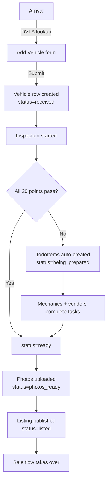

# Inventory

> **Sidebar group:** Inventory + (dynamic routes under `/vehicles/[id]`)
> **Routes owned:** 4 (2 static + 2 dynamic)
> **Primary entities:** `Vehicle`, `TodoItem`, `InspectionCheck`, `VehiclePhoto`

## What it is  *(stakeholder)*

Inventory is the heart of the app — where a dealer's stock lives. Every vehicle in the lot has a row here from the moment it arrives until it's sold (or returned). The All Vehicles list is the master grid; the Add Vehicle form is the arrival workflow; the Vehicle Detail page is the per-car file with eight tabs (Overview, Financials, Things to Do, Inspection, Photos, Listing, Appointments, Activity); and the Inspection page is the 20-point checklist that decides whether a car is "ready" for sale.

## What users can do  *(end-user)*

- See **all vehicles** in a paginated table (25 per page) with thumbnail, registration, make/model, status, days-in-stock chip, and totals.
- **Filter** by status, body type, fuel type, vehicle type. Sort by any column.
- **Search** by registration or stock ID.
- **Export to CSV** for accounting / external reporting.
- **Add a vehicle** via the arrival form. Typing a registration triggers DVLA auto-fill on blur. Buying price + fees + transport + finance provider are captured. Optional "Things to Do" at arrival.
- **Open a vehicle** to see its 8-tab detail page.
- **Update vehicle** — every editable field in one place.
- **Change status** through the lifecycle (received → inspection_pending → being_prepared → photos_pending → photos_ready → ready → listed → reserved → sold).
- **Run the 20-point inspection** — pass/fail toggles for each check + free-text notes. All-pass auto-marks the vehicle "ready"; any fail auto-creates Things-to-Do.
- **Add Things to Do** — tasks owned by users or external vendors, with costs, status, due dates.
- **Upload photos** (also accessible from the Advert module's Photo Processing page).
- **See activity** — the audit timeline filtered to this vehicle.

Permissions: `vehicle:create` (Add Vehicle), `vehicle:update`, `vehicle:status:change`, `inspection:start` and `inspection:complete`, `todo:create` and `todo:complete`.

## Routes  *(developer + AI)*

| Route | Page file | Primary component | What it shows |
|---|---|---|---|
| `/vehicles` | `src/app/(dashboard)/vehicles/page.tsx` | `VehiclesTable` + filters | Paginated master list of vehicles |
| `/inventory/add-vehicle` | `src/app/(dashboard)/inventory/add-vehicle/page.tsx` | `ArrivalForm` + `CostSummaryReceipt` | Single-page 7-section arrival workflow with sticky cost summary |
| `/vehicles/[id]` | `src/app/(dashboard)/vehicles/[id]/page.tsx` | `VehicleHeaderCard` + `VehicleDetailTabs` (8 tabs) | Full vehicle file with tabbed sub-views |
| `/vehicles/[id]/inspection` | `src/app/(dashboard)/vehicles/[id]/inspection/page.tsx` | `InspectionChecklist` | The 20-point checklist with notes |

## Components  *(developer + AI)*

`src/components/vehicles/`:

| Component | Purpose |
|---|---|
| `arrival-form.tsx` | The 7-section Add Vehicle form (Identity, Source, Documentation, Costs, Receiving, Things to Do, Pricing) |
| `cost-summary-receipt.tsx` | The right-side sticky panel showing live cost roll-up |
| `inspection-checklist.tsx` | 20-point pass/fail toggles + notes |
| `vehicle-detail-tabs.tsx` | Tab strip + content for the 8-tab detail layout |
| `things-to-do-list.tsx` | TodoItem list with status transitions |

`src/components/vehicle-detail/` — the individual tab panels:

| Component | Tab |
|---|---|
| `overview-tab.tsx` | Overview |
| `financials-tab.tsx` | Financials |
| `todo-tab.tsx` | Things to Do |
| `inspection-tab.tsx` | Inspection |
| `photos-tab.tsx` | Photos |
| `listing-tab.tsx` | Listing |
| `appointments-tab.tsx` | Appointments |
| `activity-tab.tsx` | Activity |
| `vehicle-header-card.tsx` | The header tile (registration plate, thumbnail, title, status, key stats) |
| `vehicle-detail-shell.tsx` | The wrapper coordinating tab state |
| `primitives.tsx` | Shared layout primitives for tab panels |

Shared support: `src/components/shared/reg-plate.tsx`, `vehicle-image.tsx`, `status-badge.tsx`, `days-in-stock-chip.tsx`.

## Services & data  *(developer + AI)*

| Service | Used for |
|---|---|
| `vehicle-service.ts` | CRUD + status changes + registration lookup |
| `dvla-service.ts` | DVLA lookup on registration blur in the arrival form |
| `todo-service.ts` | Add / complete things-to-do (auto-created from inspection failures) |
| `inspection-service.ts` | Start inspection, update individual point pass/fail |
| `inspection-note-service.ts` | Append free-text inspection notes |
| `photo-storage.ts` | Upload / read vehicle photos |
| `activity-service.ts` | Log every status change + edit |
| `listing-service.ts` | Read listings for the Listing tab |
| `appointment-service.ts` | Read appointments for the Appointments tab |

Entities: `Vehicle`, `VehiclePhoto`, `TodoItem`, `InspectionCheck`, `InspectionNote`, `ActivityLogEntry`.

## Workflow  *(everyone)*

## Edge cases & gotchas  *(developer)*

- **DVLA never returns model** — `model` is always `null` after auto-fill. The arrival form expects manual entry. See [`reference/api-routes.md`](../reference/api-routes.md).
- **Stock ID is permanent** — `Vehicle.stockId` is generated on insert from `Company.nextStockSeq` and never changes. Even if you edit the registration later, the stock ID sticks.
- **Inspection completion side-effects** — completing the inspection with all-pass calls `vehicleService.changeStatus(id, "ready")` and creates an activity-log entry. Any fail creates one or more `TodoItem`s via `todoService.create({ source: "from_inspection" })`.
- **Things-to-Do cost roll-up** — `Vehicle.valueAddition` is computed from the sum of completed TodoItem costs. It updates when a TodoItem moves to `done`.
- **Duplicate-reg warning** — `vehicleService.getByRegistration` runs on submit. If a match exists, the form prompts the user "Add anyway?" — duplicates are allowed (returned/removed vehicles can come back) but not silent.
- **Field-width parity in the arrival form** — every field wrapper uses `flex flex-col gap-2` and every SelectTrigger has `w-full` so dropdowns match Input widths. See commit `4f78ef0`.
- **`Vehicle.status` transitions are not enforced** — there's no state machine guard. A user with `vehicle:status:change` can move a status to any value. Plan: add transition validation in `vehicleService.changeStatus`.
