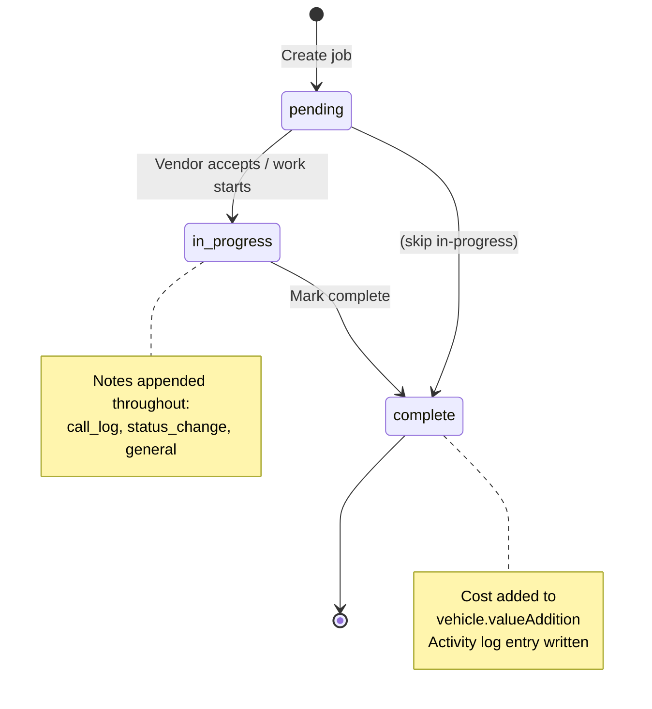

# Maintenance

> **Sidebar group:** Maintenance + `/maintenance/jobs/[id]`
> **Routes owned:** 5 (4 static + 1 dynamic)
> **Primary entities:** `MaintenanceJob`, `WorkshopJob`, `MaintenanceJobNote`, `Vendor`, `TodoItem`

## What it is  *(stakeholder)*

Maintenance is where vehicles get from "received" to "ready". Some prep work is done in-house (workshop) — mechanics, valeters, photographers on the team. Other work is sent out to external vendors (specialist body shops, alloy refurb, paintless dent repair, etc.). Both flows are tracked here.

The module has four views: a **Pipeline** showing every active job grouped by status, a **Calendar** showing when each job is scheduled, an **Inspection Queue** of vehicles waiting on their 20-point check, and a **Workshop Jobs** board for in-house technicians. Each job has its own detail page with notes (`call_log`, `status_change`, etc.) and a Job Card PDF for the mechanic.

## What users can do  *(end-user)*

- See **all active maintenance jobs** in the Pipeline grouped by status (pending / in_progress / complete).
- See the **schedule** of jobs in a calendar view.
- See the **Inspection Queue** — vehicles whose inspection is pending or in-progress.
- See **Workshop Jobs** for the in-house mechanic team.
- **Create a maintenance job** linked to a vehicle, with assigned vendor, agreed cost, and scheduled date.
- **Assign a vendor** to a pending job.
- **Track progress** via job notes (call logs, status updates).
- **Mark complete** when work is done — cost is rolled into the vehicle's `valueAddition`.
- **Print a Job Card PDF** for the mechanic / vendor.
- **View vendor performance** — jobs assigned, completion times.

Permissions: `maintenance:job:create`, `maintenance:job:update`, `maintenance:job:assign-vendor`, `maintenance:job:complete`.

## Routes  *(developer + AI)*

| Route | Page file | Primary component | What it shows |
|---|---|---|---|
| `/maintenance` | `src/app/(dashboard)/maintenance/page.tsx` | `MaintenancePipeline` | Job board grouped by status |
| `/maintenance/calendar` | `src/app/(dashboard)/maintenance/calendar/page.tsx` | `MaintenanceCalendar` (uses `BigCalendar`) | Month view of scheduled jobs |
| `/maintenance/inspection` | `src/app/(dashboard)/maintenance/inspection/page.tsx` | `InspectionQueue` | Vehicles awaiting / undergoing 20-point inspection |
| `/maintenance/workshop` | `src/app/(dashboard)/maintenance/workshop/page.tsx` | `WorkshopBoard` | In-house team's job list |
| `/maintenance/jobs/[id]` | `src/app/(dashboard)/maintenance/jobs/[id]/page.tsx` | `JobDetail` | Single job: details, notes timeline, status controls, Job Card PDF |

## Components  *(developer + AI)*

`src/components/maintenance/`:

| Component | Purpose |
|---|---|
| Maintenance pipeline cards / columns | Status grouping (pending / in_progress / complete) |
| Job creation dialog | Form for new `MaintenanceJob` with vendor picker |
| Job detail view | Header (vehicle + vendor + cost), notes timeline, action buttons |
| Notes panel | Append-only timeline of `MaintenanceJobNote` rows |
| Vendor picker | Combobox over `vendor-service.getAll()` |
| Workshop board | List of workshop-assigned jobs per technician |

Shared: `src/components/shared/big-calendar.tsx` (calendar view), `event-edit-dialog.tsx` (job edits).

PDFs: `src/components/pdf/job-card-template.tsx`.

## Services & data  *(developer + AI)*

| Service | Used for |
|---|---|
| `maintenance-service.ts` | Job CRUD + complete |
| `maintenance-note-service.ts` | Append notes (call_log / status_change / general) |
| `workshop-service.ts` | Workshop-board specific subset |
| `vendor-service.ts` | Vendor list for assignment |
| `vehicle-service.ts` | Look up vehicle for the job header + valueAddition roll-up |
| `todo-service.ts` | Reads things-to-do that may also surface here |
| `pdf-service.ts` | `generateJobCard(job)` for the printable work order |
| `activity-service.ts` | Audit log on every transition |

Entities: `MaintenanceJob`, `WorkshopJob`, `MaintenanceJobNote`, `Vendor`.

## Workflow  *(everyone)*

## Edge cases & gotchas  *(developer)*

- **Workshop vs maintenance** — `WorkshopJob` and `MaintenanceJob` are separate entities. Workshop is for in-house technicians; Maintenance is for vehicle prep with external vendors. The Workshop page is *not* a filtered view of MaintenanceJob — it's its own table. Future plan: this distinction collapses — see the build plan.
- **Job Card PDF** — printed for both internal and external jobs. The template uses the same registered fonts as Invoice and Warranty Certificate. See [`reference/pdfs.md`](../reference/pdfs.md).
- **Notes are append-only** — `MaintenanceJobNote` rows can't be deleted by design (audit). If a user adds a note in error, add a corrective note rather than allowing delete.
- **No price guard** — there's no validation that `MaintenanceJob.cost ≤ vehicle.minimumSalePrice - vehicle.totalBuyingPrice`. Over-spending on prep is possible. The Cost Summary tile on the Vehicle Detail page is the visual check.
- **Calendar widget** — uses `react-big-calendar` styled with the surface system. Heavy CSS overrides; touch with care.
