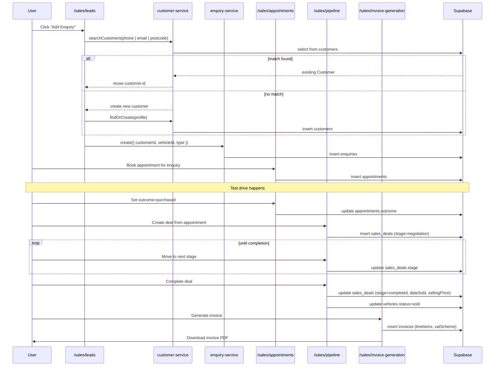

# Sales

> **Sidebar group:** Sales
> **Routes owned:** 5
> **Primary entities:** `Lead`, `Enquiry`, `Customer`, `Appointment`, `SalesDeal`, `Invoice`

## What it is  *(stakeholder)*

Sales tracks the journey of a buyer from first contact to signed invoice. A buyer expresses interest (a **lead** or, in the newer customer-first model, an **enquiry**); the sales team books a **test drive** (appointment); the test drive turns into a **deal** that progresses through stages (negotiation → offer → deposit paid → completion); finally the deal is **invoiced** and the vehicle is marked sold.

Two parallel data models exist today: the legacy `Lead` entity (one row per enquiry with embedded customer fields) and the newer `Customer + Enquiry` pair (deduplicated customers, multiple enquiries per customer). New code should use Enquiry; Lead is being phased out.

## What users can do  *(end-user)*

- See **incoming leads** with source, stage, vehicle of interest.
- Use the **Add Enquiry dialog** — customer-search-first flow (looks for an existing `Customer` by phone, email, postcode, name before creating a new one).
- **Book an appointment** for a lead/enquiry. Pick the vehicle, slot, salesperson.
- See **all appointments** in a list, sorted by date.
- Track **appointment outcomes** (interested / not interested / another vehicle / purchased / pending).
- See the **sales pipeline** — every open deal grouped by stage with deal value.
- **Move a deal through stages** (negotiation → offer → deposit paid → completion).
- **Complete a deal** — captures the final sale price, marks the vehicle `sold`.
- **Generate the sale invoice** in PDF form (VAT margin scheme or VAT qualifying).
- See **closed-won and closed-lost** deals with reasons.

Permissions: `lead:create`, `lead:update`, `appointment:create`, `appointment:update`, `deal:create`, `deal:stage:change`, `deal:complete`, `invoice:generate`.

## Routes  *(developer + AI)*

| Route | Page file | Primary component | What it shows |
|---|---|---|---|
| `/sales/leads` | `src/app/(dashboard)/sales/leads/page.tsx` | `LeadsList` + `AddEnquiryDialog` | All leads with filters + customer-first add flow |
| `/sales/appointments` | `src/app/(dashboard)/sales/appointments/page.tsx` | `AppointmentsList` | Upcoming + past appointments |
| `/sales/pipeline` | `src/app/(dashboard)/sales/pipeline/page.tsx` | `SalesPipeline` | Open deals grouped by stage |
| `/sales/deals` | `src/app/(dashboard)/sales/deals/page.tsx` | `DealsList` | All deals (open + closed) |
| `/sales/invoice-generation` | `src/app/(dashboard)/sales/invoice-generation/page.tsx` | `InvoiceGenerationForm` | Pick a completed deal → generate invoice PDF |

## Components  *(developer + AI)*

`src/components/sales/`:

| Component | Purpose |
|---|---|
| Leads list | Table of leads with status pills |
| Appointment dialog | Pick vehicle + slot + salesperson |
| Pipeline kanban | Stage columns with drag/drop or stage-change buttons |
| Deal detail | Open negotiation history + completion controls |
| Invoice generation form | Pick deal → pick VAT scheme → review line items → render PDF |

`src/components/enquiries/`:

| Component | Purpose |
|---|---|
| `add-enquiry-dialog.tsx` | The top-level Add Enquiry dialog (multi-step) |
| `customer-search-step.tsx` | Step 1 — search existing customers |
| `customer-result-row.tsx` | One row in the search results |
| `create-new-customer-row.tsx` | "No match — create new" row |
| `customer-profile-fields.tsx` | Customer name + phone + email + postcode fields |
| `enquiry-details-fields.tsx` | Vehicle of interest, type, source |
| `enquiry-type-dropdown.tsx` | Quick / Full / Sold-to-another |
| `source-dropdown.tsx` | Lead source (AutoTrader, Walk-in, etc.) |
| `salesperson-dropdown.tsx` | Assign to a sales user |
| `postcode-lookup-field.tsx` | Postcode → address lookup (canned data in v1) |
| `quick-enquiry-form.tsx` | The simplified single-step enquiry form |
| `full-enquiry-form.tsx` | The full multi-step enquiry form |
| `step-actions.tsx` | Back / Next / Save buttons |

PDFs: `src/components/pdf/invoice-template.tsx`.

## Services & data  *(developer + AI)*

| Service | Used for |
|---|---|
| `lead-service.ts` | Legacy lead CRUD (still used by older pages) |
| `enquiry-service.ts` | Newer customer-first enquiry CRUD |
| `customer-service.ts` | Customer search + dedup (`findOrCreate`) |
| `appointment-service.ts` | Booking + status + outcome |
| `sales-service.ts` | Deal CRUD + stage transitions + complete |
| `invoice-service.ts` | Invoice CRUD + draft → sent transition |
| `pdf-service.ts` | `generateInvoice(invoice)` for the PDF |
| `vehicle-service.ts` | Look up + mark sold |
| `vat-service` *(no separate file — utilities in `src/lib/vat.ts`)* | `calculateVat`, `formatVatLabel`, VAT margin arithmetic |
| `activity-service.ts` | Audit every stage transition + invoice issuance |

Entities: `Lead`, `Enquiry`, `Customer`, `Appointment`, `SalesDeal`, `Invoice`.

## Workflow  *(everyone)*

## Edge cases & gotchas  *(developer)*

- **Lead vs Enquiry duality** — both models live in the DB today. New code uses Enquiry + Customer; legacy pages still call `lead-service`. Future plan: deprecate `lead-service` after migration is complete.
- **Customer dedup** — `customer-service.searchCustomers` searches phone, email, postcode, name. Phone normalisation is naïve (`07700 900111` vs `+447700900111` may not match). Plan: add a normaliser.
- **VAT margin formula** — `(saleNet - vehicleCost) / 6`. Defined in `src/lib/vat.ts`. The "/6" is `20% / 120%`. Don't reimplement it elsewhere.
- **Completing a deal mutates the vehicle** — `salesService.complete` calls `vehicleService.changeStatus(vehicleId, "sold")` and writes `dateSold`. If the deal completion fails, both writes need to be undone — there's no transactional guard today.
- **Invoice generation is offline** — the PDF is generated client-side and downloaded. There is no "send by email" automation; sending the invoice is a manual step outside the app.
- **No deposit-receipt PDF** — when a deal moves to `deposit_paid` no PDF is produced. The deposit row exists in the deal record. Plan: add a deposit receipt template.
- **Appointment slots are free-form** — no calendar conflict detection. Two appointments can sit on the same vehicle at the same time.
