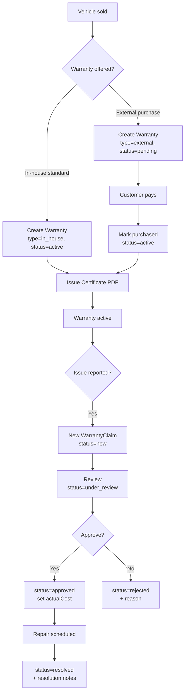

# Warranties

> **Sidebar group:** Warranties + `/warranties/[id]`
> **Routes owned:** 4 (3 static + 1 dynamic)
> **Primary entities:** `Warranty`, `WarrantyClaim`, `SalesDeal`, `Vehicle`

## What it is  *(stakeholder)*

After a vehicle is sold, the dealer either includes a built-in **in-house warranty** (claim costs paid by the dealer) or adds an **external warranty** from a third-party underwriter. When the customer reports a problem, the dealer files a **claim**, reviews it, approves or rejects, and tracks resolution. This module owns all three flows: managing warranties, managing claims, and issuing the warranty certificate PDF the customer receives.

## What users can do  *(end-user)*

- See all **in-house warranties** with status and cover period.
- See all **external warranties** with provider + reference number.
- See all **claims** across both warranty types, sortable by status (new / under review / approved / rejected / resolved).
- **Issue a warranty** to a sold vehicle — pick type, cover term, additional notes.
- **Mark as purchased** when the customer pays for an optional warranty add-on.
- **Generate the certificate PDF** to print or email to the customer.
- **File a claim** under a warranty — describe issue, attach diagnosis, set expected cost.
- **Review a claim** — approve (with actual cost + resolution notes) or reject (with reason).
- **Mark resolved** when the repair completes.

Permissions: `warranty:create`, `warranty:update`, `warranty:claim:create`, `warranty:claim:resolve`.

## Routes  *(developer + AI)*

| Route | Page file | Primary component | What it shows |
|---|---|---|---|
| `/warranties/in-house` | `src/app/(dashboard)/warranties/in-house/page.tsx` | `WarrantyTable` filtered to `type=in_house` | All in-house warranties + KPIs |
| `/warranties/external` | `src/app/(dashboard)/warranties/external/page.tsx` | `WarrantyTable` filtered to `type=external` | All external warranties + provider details |
| `/warranties/claims` | `src/app/(dashboard)/warranties/claims/page.tsx` | `ClaimsList` | All claims grouped by status |
| `/warranties/[id]` | `src/app/(dashboard)/warranties/[id]/page.tsx` | `WarrantyDetailSheet` | One warranty with cover details, claim list, certificate trigger |

## Components  *(developer + AI)*

`src/components/warranties/`:

| Component | Purpose |
|---|---|
| `warranty-table.tsx` | Reusable table; filtered per page |
| `kpi-strip.tsx` | Top-of-page KPI tiles (warranties active, claims open, etc.) |
| `filter-chips.tsx` | Status / type filter chips |
| `status-pill.tsx` | Color-coded status indicator |
| `provider-badge.tsx` | External warranty provider chip |
| `pending-purchase-banner.tsx` | Banner when a warranty is pending customer purchase |
| `mark-purchased-dialog.tsx` | Mark a pending warranty as paid |
| `new-warranty-dialog.tsx` | Create-warranty form |
| `new-claim-dialog.tsx` | File-claim form (vehicle, issue, expected cost) |
| `warranty-detail-sheet.tsx` | Right-side sheet for the warranty detail view |

PDFs: `src/components/pdf/warranty-certificate-template.tsx`.

## Services & data  *(developer + AI)*

| Service | Used for |
|---|---|
| `warranty-service.ts` | Warranty CRUD + `getWithClaims` |
| `claim-service.ts` | Claim CRUD + status transitions |
| `pdf-service.ts` | `generateWarrantyCertificate(warranty)` |
| `sales-service.ts` | Read sale deal that the warranty attaches to |
| `vehicle-service.ts` | Look up vehicle for header info |
| `activity-service.ts` | Log every warranty + claim state change |

Entities: `Warranty`, `WarrantyClaim`.

## Workflow  *(everyone)*

## Edge cases & gotchas  *(developer)*

- **In-house vs external** — `Warranty.type` drives whether claim cost lands on the dealer (in-house) or is reimbursed by the underwriter (external). The UI shows different fields per type.
- **Pending purchase status** — external warranties start as `pending` until the customer pays. The `pending-purchase-banner` on the warranty detail sheet prompts the user to confirm payment. If the customer never pays, the warranty stays pending — there's no auto-cancel.
- **Claim cost vs vehicle cost** — `WarrantyClaim.actualCost` is recorded but isn't currently rolled into the vehicle's P&L. Future plan: tie into a per-vehicle ledger when one exists.
- **Certificate font registration** — uses the same Figtree font as the invoice and job card. Registered once at the top of the template file (`Font.register()`).
- **Resolved doesn't archive** — `status=resolved` keeps the claim in the active claims list; users wanting to "close" a claim should sort/filter by status. Plan: add an explicit `archived` status.
- **No customer-facing portal** — every action here is internal staff. The customer receives PDF certificates by email outside the app.
