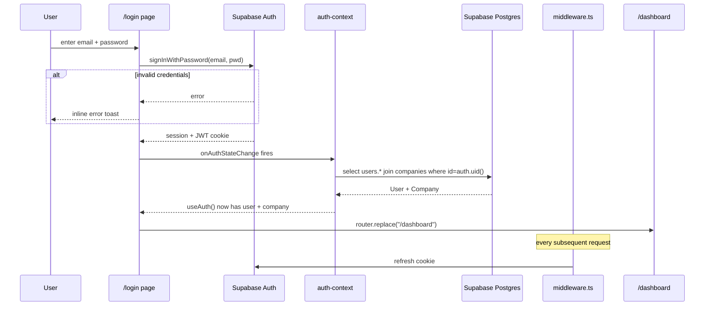

# Auth and permissions

> **Audience:** developers + AI agents
> **Last verified against `main` HEAD:** `86f9d91`

## Authentication

The app uses **Supabase Auth** with email + password. Sessions are JWT cookies refreshed on every request by the root middleware.

### Files in the chain

| File | Role |
|---|---|
| `src/app/(auth)/login/page.tsx` | Email + password form. Calls `supabase.auth.signInWithPassword()`. |
| `src/app/(auth)/forgot-password/page.tsx` | Triggers `supabase.auth.resetPasswordForEmail()` |
| `src/app/(auth)/reset-password/page.tsx` | Accepts the password-reset token from email and sets a new password |
| `middleware.ts` (repo root) | Calls `updateSession()` on every request — refreshes the cookie, redirects unauthenticated traffic to `/login?next=<path>` |
| `src/lib/supabase/middleware.ts` | The `updateSession()` implementation — public-path allow-list + redirect logic |
| `src/lib/supabase/client.ts` | Browser Supabase client (singleton, validates env vars at init) |
| `src/lib/supabase/server.ts` | Server-side Supabase client (uses Next.js cookies for SSR) |
| `src/lib/supabase/admin.ts` | Service-role client (server-only, for privileged operations) |
| `src/contexts/auth-context.tsx` | React context that hydrates the `User` + `Company` rows after login |
| `src/app/(dashboard)/layout.tsx` | Reads `useAuth()`, shows skeleton while loading, redirects to `/login` on unauth |
| `src/lib/services/auth-service.ts` | Reads `public.users` joined to `companies` |

### Sign-in sequence



### Public paths (skip auth)

| Path | Reason |
|---|---|
| `/login`, `/forgot-password`, `/reset-password` | Auth entry points |
| `/_next/*`, `/favicon.ico`, image asset paths | Static assets |
| `/api/*` | API routes handle their own auth (e.g. DVLA proxy doesn't need a user) |

`src/lib/supabase/middleware.ts` is the canonical list — update there if a new public path is added.

## The `useAuth()` hook

```typescript
const { user, company, loading, error, signIn, signOut } = useAuth();
```

| Property | Type | Notes |
|---|---|---|
| `user` | `User \| null` | The signed-in user row from `public.users`. Null until hydrated or on sign-out. |
| `company` | `Company \| null` | The user's company (single-tenant — there's exactly one). |
| `loading` | `boolean` | True during the initial `onAuthStateChange` + hydration. |
| `error` | `string \| null` | Set if env vars are missing — short-circuits to the "Can't connect" UI. |
| `signIn` | `(email, pwd) => Promise<void>` | Wraps `supabase.auth.signInWithPassword`. |
| `signOut` | `() => Promise<void>` | Clears the session and the in-memory cache. |

## Permissions

The app uses a **capability-based** permission system. Roles are bundles of capabilities; granting a role grants all its capabilities. Users can also have direct capability grants in `user_permissions`.

### The 38 capabilities

Defined in `src/lib/capabilities.ts` as `ALL_CAPABILITIES`. Grouped by domain in `CAPABILITY_GROUPS`. Examples (not exhaustive — read the source for the live list):

| Domain | Example capabilities |
|---|---|
| Inventory | `vehicle:create`, `vehicle:update`, `vehicle:status:change`, `vehicle:delete` |
| Inspection | `inspection:start`, `inspection:complete` |
| Maintenance | `maintenance:job:create`, `maintenance:job:complete`, `maintenance:job:assign-vendor` |
| Photos | `photo:upload`, `photo:process`, `photo:delete` |
| Adverts | `advert:create`, `advert:publish`, `advert:unpublish` |
| Sales | `lead:create`, `appointment:create`, `deal:stage:change`, `deal:complete` |
| Invoicing | `invoice:generate`, `invoice:send`, `invoice:void` |
| Warranties | `warranty:create`, `warranty:claim:resolve` |
| Returns | `return:create`, `return:resolve` |
| Admin | `user:invite`, `user:role:change`, `settings:update`, `master-sheet:export` |

### Checking a capability

Always use `useCan()` from `src/hooks/use-permissions.ts`:

```typescript
import { useCan } from "@/hooks/use-permissions";

const canGenerateInvoice = useCan("invoice:generate");
if (canGenerateInvoice) { … }
```

**Never** check roles directly (`user.role === "owner"`) — roles can change without a deploy, capabilities are the authority.

### Role bundles

`src/lib/roles.ts` defines which capabilities each role bundles. The effective capability set for a user is:

```
effective = union(
  capabilitiesForRoles(user.roles),
  user_permissions where userId = user.id
)
```

If `user.isSuperUser === true`, every `useCan(*)` returns `true`, bypassing all checks.

### Granting / revoking

`src/lib/services/permission-service.ts`:

- `grantCapability(userId, capability, grantedBy)` — inserts a row in `user_permissions`.
- `revokeCapability(userId, capability)` — deletes the row.

Role assignment is in `team-service.ts` (`updateUserRole`).

## Activity-log nullable userId

`ActivityLogEntry.userId` is nullable. When null, the action came from outside the app (system events, future vendor portal). The activity feed UI renders these as "System" or "Vendor (via portal)" based on `actionType`.
