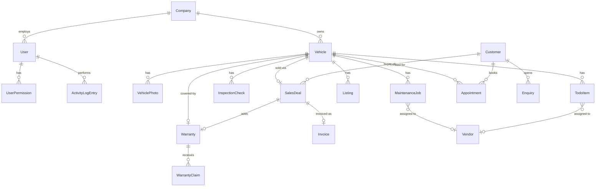

# Data model

> **Audience:** developers + AI agents
> **Last verified against `main` HEAD:** `86f9d91`
> **Source of truth:** `src/lib/types.ts`. When this doc and that file disagree, the file is correct.

## Entities

| Entity | Table | Key fields | Owned by service |
|---|---|---|---|
| `Company` | `companies` | `id`, `name`, `stockIdPrefix`, `nextStockSeq` | (no service — read via auth context) |
| `User` | `users` | `id`, `companyId`, `email`, `role`, `roles[]`, `isSuperUser` | `auth-service`, `team-service` |
| `UserPermission` | `user_permissions` | `userId`, `capability` | `permission-service` |
| `Vehicle` | `vehicles` | `id`, `companyId`, `stockId`, `registration`, `status`, `make/model/year`, costs, `dateSold` | `vehicle-service` |
| `VehiclePhoto` | `vehicle_photos` | `vehicleId`, `url`, `processingState` | `photo-storage` |
| `Customer` | `customers` | `id`, `phone`, `email`, `postcode`, `companyName?` | `customer-service` |
| `Enquiry` | `enquiries` | `id`, `customerId`, `vehicleId?`, `activeType`, `lostReason?` | `enquiry-service` |
| `Lead` | `leads` | `id`, `customerName`, `customerPhone`, `vehicleId`, `status`, `source` | `lead-service` *(legacy, being replaced by Enquiry)* |
| `Appointment` | `appointments` | `id`, `vehicleId`, `customerId`, `startsAt`, `status`, `outcome` | `appointment-service` |
| `SalesDeal` | `sales_deals` | `id`, `vehicleId`, `customerId`, `stage`, `dealValue` | `sales-service` |
| `Listing` | `listings` | `id`, `vehicleId`, `channel`, `status`, `publishedAt` | `listing-service` |
| `Warranty` | `warranties` | `id`, `vehicleId`, `saleDealId`, `type` (`in_house`/`external`), `status` | `warranty-service` |
| `WarrantyClaim` | `warranty_claims` | `id`, `warrantyId`, `status`, `actualCost`, `resolution` | `claim-service` |
| `MaintenanceJob` | `maintenance_jobs` | `id`, `vehicleId`, `vendorId?`, `status`, `cost` | `maintenance-service` |
| `MaintenanceJobNote` | `maintenance_job_notes` | `jobId`, `body`, `noteType` | `maintenance-note-service` |
| `WorkshopJob` | `workshop_jobs` | `id`, `vehicleId`, `assignedTo`, `status` | `workshop-service` |
| `Vendor` | `vendors` | `id`, `name`, `specialities[]` | `vendor-service` |
| `TodoItem` | `todo_items` | `id`, `vehicleId`, `description`, `vendorId?`, `cost`, `source`, `status` | `todo-service` |
| `InspectionCheck` | `inspection_checks` | `id`, `vehicleId`, `pointKey`, `pass`, `notes` | `inspection-service` |
| `InspectionNote` | `inspection_notes` | `vehicleId`, `body` | `inspection-note-service` |
| `Invoice` | `invoices` | `id`, `type` (purchase/sale), `vatScheme`, `lineItems[]`, `total` | `invoice-service` |
| `VehicleReturn` | `vehicle_returns` | `id`, `vehicleId`, `status`, `resolutionPath` | `return-service` |
| `ActivityLogEntry` | `activity_log` | `id`, `userId?`, `actionType`, `vehicleId?`, `metadata` | `activity-service` |
| `Notification` | `notifications` | `id`, `userId`, `type`, `body`, `readAt?` | `notification-service` |

## Status / classification unions

Domain unions exported from `src/lib/types.ts`:

| Union | Values |
|---|---|
| `UserRole` | `owner`, `admin`, `inventory_manager`, `driver`, `inspector`, `prep_lead`, `sales` |
| `VehicleStatus` | `received`, `inspection_pending`, `being_prepared`, `photos_pending`, `photos_ready`, `ready`, `listed`, `reserved`, `sold`, `returned` |
| `VehicleType` | `car`, `van` |
| `BodyType` | `hatchback`, `saloon`, `suv`, `mpv`, `estate`, `convertible`, `coupe` |
| `FuelType` | `petrol`, `diesel`, `hybrid`, `electric` |
| `Transmission` | `automatic`, `manual` |
| `SourceType` | `auction`, `private`, `trade_in`, `dealer`, `other` |
| `PurchaseChannel` | `vendor`, `supplier`, `g_trader`, `direct` |
| `ServiceHistory` | `full`, `partial`, `none`, `unknown` |
| `FinanceProvider` | `next_gear`, `close_brothers`, `bca`, `infinit`, `none` |
| `TodoStatus` | `pending`, `in_progress`, `done`, `cancelled` |
| `TodoSource` | `manual`, `from_inspection`, `auto_applied_from_template` |
| `MaintenanceStatus` | `pending`, `in_progress`, `complete` |
| `ListingChannel` | `website`, `autotrader`, `ebay`, `facebook` |
| `ListingStatus` | `draft`, `active`, `sold`, `archived` |
| `LeadStatus` | `new`, `contacted`, `appointment_booked`, `lost` *(legacy)* |
| `AppointmentStatus` | `scheduled`, `confirmed`, `completed`, `cancelled`, `no_show` |
| `AppointmentOutcome` | `interested`, `not_interested`, `another_vehicle`, `purchased`, `pending` |
| `SalesStage` | `negotiation`, `offer`, `deposit_paid`, `completion`, `completed`, `lost` |
| `WarrantyType` | `in_house`, `external` |
| `WarrantyStatus` | `pending`, `active`, `expired`, `cancelled` |
| `WarrantyPurchaseStatus` | `not_purchased`, `pending`, `purchased` |
| `ClaimStatus` | `new`, `under_review`, `approved`, `rejected`, `resolved` |
| `InvoiceType` | `purchase`, `sale` |
| `InvoiceStatus` | `draft`, `sent`, `paid`, `void` |
| `VatScheme` | `vat_qualifying`, `margin`, `not_sold` |
| `ReturnStatus` | `pending`, `under_review`, `resolved`, `rejected` |
| `ReturnResolutionPath` | `refund`, `replacement`, `repair`, `finance_resolution` |
| `EnquiryStatus` | `open`, `closed_won`, `closed_lost` |
| `EnquiryActiveType` | `quick`, `full`, `sold_to_another` |
| `LostReason` | `lost_contact`, `lost_duplicate`, `lost_finance`, `lost_people`, `lost_price`, `lost_product`, `lost_purchased`, `lost_px`, `lost_vehicle_sold` |
| `ActivityActionType` | 25+ values covering vehicle / lead / sale / warranty / claim mutations — see source |
| `NotificationType` | `info`, `warning`, `success`, `action_required` |

## Core ERD

The 12 most central entities and how they relate:



## Stock ID generation

When a Vehicle is created:

1. `vehicleService.create` reads `company.nextStockSeq`.
2. The new `stockId` is `${company.stockIdPrefix}-${String(seq).padStart(4, "0")}` → e.g. `CC-0042`.
3. `company.nextStockSeq` is incremented atomically.
4. The stock ID is permanent — it does not change if the registration or other identity fields are corrected later.

## VAT model

`Vehicle.vatOnBuyingPrice` is the standard-rate VAT on the buying price (used for record-keeping). `Invoice.vatScheme` determines how VAT is shown on the sale invoice:

- `vat_qualifying` — standard VAT on the full sale price.
- `margin` — VAT only on (sale − purchase) margin, divided by 6 (= 20% of margin/1.2). The default for used cars.
- `not_sold` — vehicle was never sold (returns / write-offs).

The arithmetic is in `src/lib/vat.ts` (`calculateVat()`, `formatVatLabel()`).

## Activity log shape

```typescript
{
  id: UUID;
  userId: UUID | null;     // null = system event or vendor portal action
  companyId: UUID;
  actionType: ActivityActionType;
  vehicleId: UUID | null;
  customerId: UUID | null;
  metadata: Record<string, unknown> | null;  // free-form per actionType
  createdAt: ISODateTime;
}
```

`userId: null` renders in the activity log as "System" or "Vendor (via portal)" depending on the action type.
